URD: Quick Start
================
Jeff Farrell
4/26/2018

``` r
# Load packages
suppressPackageStartupMessages(library(rgl))
```

    ## Warning: package 'rgl' was built under R version 3.4.3

``` r
suppressPackageStartupMessages(library(URD))
```

    ## Warning: package 'Matrix' was built under R version 3.4.2

``` r
knitr::opts_chunk$set(echo = TRUE)
rgl::setupKnitr()
```

Introduction
============

This is a quick walkthrough of how to use **URD** to analyze a data set. The zebrafish data has been subset, and only cells belonging to two cell-type lineages (the notochord and prechordal plate) are included, in order to make this quick and easy to run. These two cell types are part of the axial mesoderm, and so they share a common progenitor type. This analysis should run on an average laptop in under an hour. For analyses with more cells, processing time will be longer, and it can be advantageous to offload some steps to a computing cluster. This process is more detailed in the supplementary analysis, where we analyzed the full zebrafish dataset. Additionally, the supplementary analysis contains much more information about optimizing some steps of the analysis.

Create URD object
=================

All information associated with a reconstruction project is stored in an URD object. Most functions in the URD package take an URD object as input, and many of them return an URD object that has been operated on or had results stored in one of its slots. You can learn more about URD objects with `?URDclass`.

``` r
# Read axial mesoderm count data and metadata
# count.data must be provided as a matrix, not a data.frame
count.axial <- as.matrix(read.table("data/count.axial.txt.gz")) 
meta.axial <- read.table("data/meta.axial.txt.gz")

# Create an URD object, which will filter the data, then normalize and log-transform it.
axial <- createURD(count.data = count.axial, meta = meta.axial, min.cells=3, min.counts=3)
```

    ## 2018-04-30 20:46:20: Filtering cells by number of genes.

    ## 2018-04-30 20:46:22: Filtering genes by number of cells.

    ## 2018-04-30 20:46:25: Filtering genes by number of counts across entire data.

    ## 2018-04-30 20:46:28: Filtering genes by maximum observed expression.

    ## 2018-04-30 20:46:31: Creating URD object.

    ## 2018-04-30 20:46:34: Determining normalization factors.

    ## 2018-04-30 20:46:35: Normalizing and log-transforming the data.

    ## 2018-04-30 20:46:43: Finishing setup of the URD object.

    ## 2018-04-30 20:46:44: All done.

Calculate variable genes
========================

Single-cell RNAseq data is noisy, so we perform our analyses using only those genes that exhibit greater variability than those of similar expression levels. In theory, those genes have biological variability across cells in addition to their technical variability.

``` r
# Copy stage from @meta to @group.ids 
axial@group.ids$stage <- as.character(axial@meta[rownames(axial@group.ids),"stage.nice"])

# Get variable genes for each group of 3 stages
# (Normally would do this for each stage, but there are not very many cells in this subset of the data)
# diffCV.cutoff can be varied to include more or fewer genes.
stages <- sort(unique(axial@group.ids$stage))
var.by.stage <- lapply(seq(3,12,3), function(n) {
  findVariableGenes(axial, cells.fit=cellsInCluster(axial, "stage", stages[(n-2):n]), set.object.var.genes=F, diffCV.cutoff=0.3, mean.min=.005, mean.max=100, main.use=paste0("Stages ", stages[n-2], " to ", stages[n]), do.plot=T)
})
```

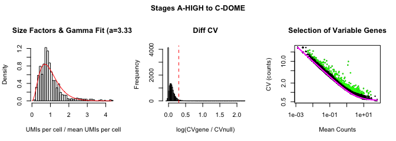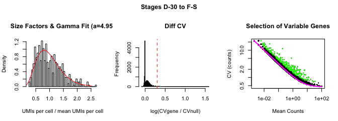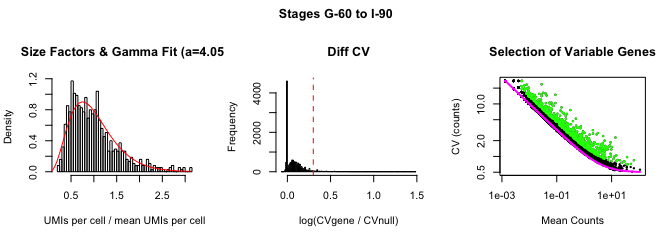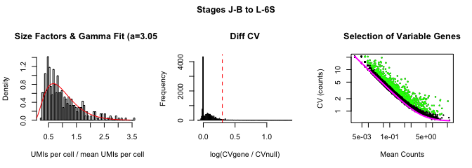

``` r
# Combine the results from each group of stages into a single list of variable genes and load into the URD object
var.genes <- sort(unique(unlist(var.by.stage)))
axial@var.genes <- var.genes
```

Calculate PCA and tSNE
======================

PCA and tSNE are not strictly required for building a tree using URD, but remain useful tools for exploring the data.

``` r
# Calculate PCA and consider those PCs that with standard deviation 2x expected by noise as significant
axial <- calcPCA(axial, mp.factor = 2)
```

    ## [1] "2018-04-30 20:46:52: Centering and scaling data."
    ## [1] "2018-04-30 20:46:53: Removing genes with no variation."
    ## [1] "2018-04-30 20:46:53: Calculating PCA."
    ## [1] "2018-04-30 20:47:12: Estimating significant PCs."
    ## [1] "Marchenko-Pastur eigenvalue null upper bound: 2.99477037008262"
    ## [1] "11 PCs have eigenvalues larger than 2 times null upper bound."
    ## [1] "Storing 22 PCs."

``` r
pcSDPlot(axial)
```

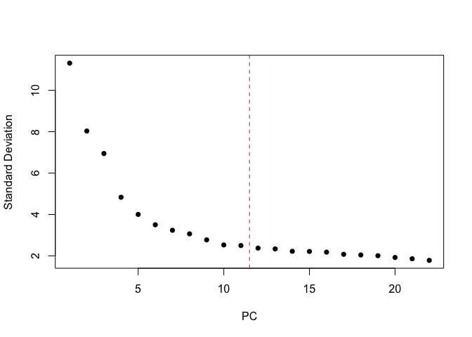

``` r
# Calculate tSNE
set.seed(19)
axial <- calcTsne(object = axial)
```

In this small subset of the data, even the tSNE projection can visualize the branching structure between the two cell populations, though this is not true in the full data.

``` r
plotDim(axial, "stage.nice", plot.title = "tSNE: Stage")
```

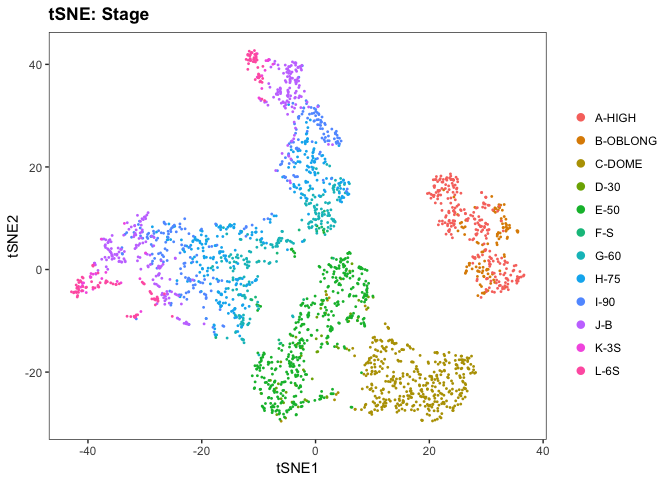

``` r
plotDim(axial, "NOTO", plot.title="tSNE: noto expression (Notochord marker)")
```


``` r
plotDim(axial, "GSC", plot.title="tSNE: gsc expression (Prechordal plate marker)")
```

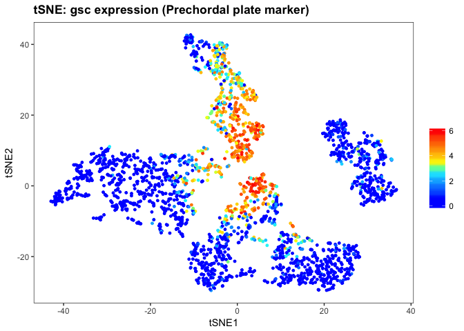

Calculate Diffusion Map
=======================

In order to find trajectories through the data, we calculate transition probabilities between cells in the data. This is part of the construction of a diffusion map, and the diffusion map is a handy way to visualize whether good transition probabilities have been calculated. Thus, we use the *destiny* package to calculate a diffusion map.

This is a critical step in the construction of a branching tree using URD; bad parameters will result in non-sensical results. Important parameters to optimize are: (1) the number of nearest neighbors (`knn`) (a good starting point is the square root of the number of cells in the data, but this may need to be increased or decreased depending on the frequency of different cell types in your data), and (2) the width of the Gaussian used to transform cell-cell distances into transition probabilities (`sigma`). `"local"` can be a good starting point that tries to predict the right sigma for each cell in the data, but often global parameters work better; `NULL` will attempt to auto-determine sigma, but it frequently overestimates the optimal setting. The supplementary analysis from our mansucript includes examples of changing the parameters for the diffusion maps on a more complicated data set that may be helpful.

``` r
# In this case, knn=100 (larger than sqrt(n.cells)) works well because there are not many cell types.
# Sigma 16 is slightly smaller than the sigma auto-determined by using NULL parameter.
axial <- calcDM(axial, knn = 100, sigma=16)
```

    ## [1] "Using provided global sigma 16"

The diffusion map can be inspected visually by plotting several pairs of dimensions. In small data sets, the structure of differentiation may already be very apparent in the diffusion map (as it is here). When more cell types are present, it is more challenging, but usually a couple of decisions are readily visible and can be helpful for optimizing parameters.

``` r
plotDimArray(axial, reduction.use = "dm", dims.to.plot = 1:8, outer.title = "Diffusion Map (Sigma 16, 100 NNs): Stage", label="stage", plot.title="", legend=F)
```

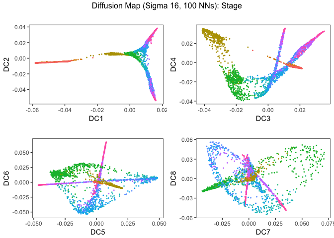

The transitions can also be visualized on the tSNE projection if there is recognizable structure in that representation that might help determine whether `sigma` and `knn` are set correctly.

``` r
plotDim(axial, "stage.nice", transitions.plot = 10000, plot.title="Developmental stage (with transitions)")
```

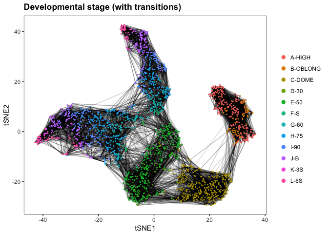

Calculate pseudotime
====================

We calculate pseudotime by starting with a group of root cells, and then performing a probabilistic breadth-first graph search using the transition probabilities. This moves step-wise outward from the root cells, until the entire graph has been visited. Several simulations are run, and then pseudotime is calculated as the average iteration that visited each cell.

``` r
# Here we use all cells from the first stage as the root
root.cells <- cellsInCluster(axial, "stage", "A-HIGH")

# Then we run 'flood' simulations
axial.floods <- floodPseudotime(axial, root.cells = root.cells, n=50, minimum.cells.flooded = 2, verbose=F)

# The we process the simulations into a pseudotime
axial <- floodPseudotimeProcess(axial, axial.floods, floods.name="pseudotime")
```

We can make sure that enough simulations have been performed by looking at the change in cell pseudotime as more simulations are added. Here, we can see that an asymptote was reached around 30 simulations, so 50 was enough.

``` r
pseudotimePlotStabilityOverall(axial)
```

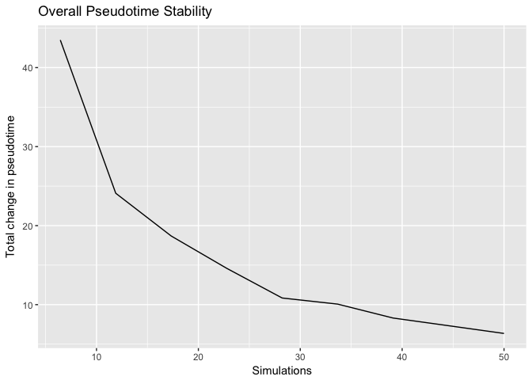

We can also plot pseudotime on the tSNE (to confirm that it makes sense).

``` r
plotDim(axial, "pseudotime")
```

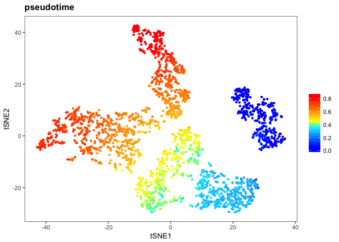

More helpful is to investigate the distribution of pseudotime for each developmental stage. In this case it looks pretty good. The stages are in the correct order, and there is overlap between neighboring stages (as expected), but they do not completely collapse on top of each other (which often indicates that sigma is too large in the diffusion map). (**Note:** the curve for High stage looks weird because these cells were used as the root, which means they all have pseudotime 0, which disrupts the density plot kernel.)

``` r
plotDists(axial, "pseudotime", "stage", plot.title="Pseudotime by stage")
```

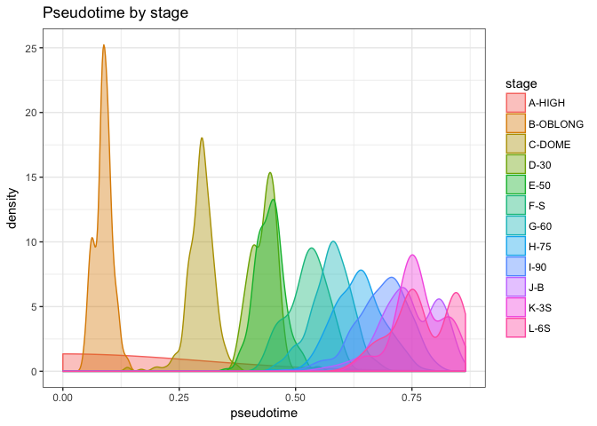

Find tips
=========

URD requires that the terminal cell populations are defined. In our case, we used clusters from the final developmental stage as the terminal cell populations. Here we make a sub-setted URD object that just contains those cells from the last stage, and then perform PCA, tSNE, and cluster those cells.

``` r
# Create a subsetted object of just those cells from the final stage
axial.6somite <- urdSubset(axial, cells.keep=cellsInCluster(axial, "stage", "L-6S"))

# Use the variable genes that were calculated only on the final group of stages (which
# contain the last stage).
axial.6somite@var.genes <- var.by.stage[[4]]

# Calculate PCA and tSNE
axial.6somite <- calcPCA(axial.6somite, mp.factor = 1.5)
pcSDPlot(axial.6somite)
```

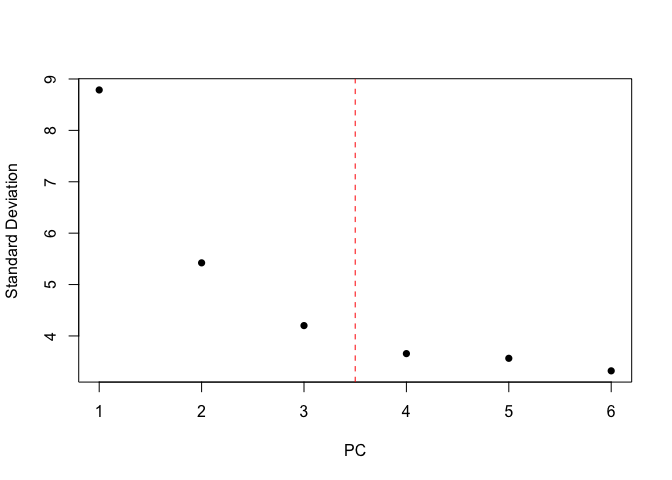

``` r
set.seed(20)
axial.6somite <- calcTsne(axial.6somite)

# Calculate graph clustering of these cells
axial.6somite <- graphClustering(axial.6somite, num.nn = 50, do.jaccard=T, method="Louvain")
```

    ## [1] "2018-04-30 20:49:34: Centering and scaling data."
    ## [1] "2018-04-30 20:49:34: Removing genes with no variation."
    ## [1] "2018-04-30 20:49:34: Calculating PCA."
    ## [1] "2018-04-30 20:49:34: Estimating significant PCs."
    ## [1] "Marchenko-Pastur eigenvalue null upper bound: 10.4091711702581"
    ## [1] "3 PCs have eigenvalues larger than 1.5 times null upper bound."
    ## [1] "Storing 6 PCs."

By plotting the expression of marker genes, we can determine that cluster 1 is the notochord and cluster 2 is the prechordal plate.

``` r
plotDim(axial.6somite, "Louvain-50", plot.title = "Louvain (50 NN) graph clustering", point.size=3)
```

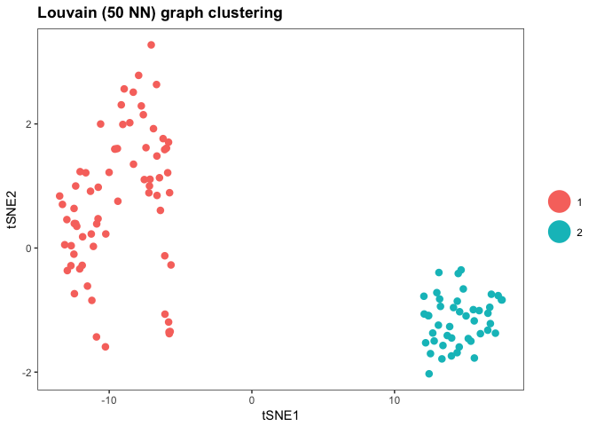

``` r
plotDim(axial.6somite, "HE1A", plot.title="HE1A (Differentiated prechordal plate marker)")
```

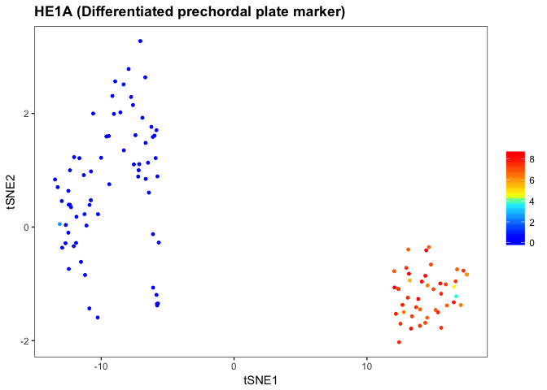

``` r
plotDim(axial.6somite, "SHHA", plot.title="SHHA (Notochord marker)")
```

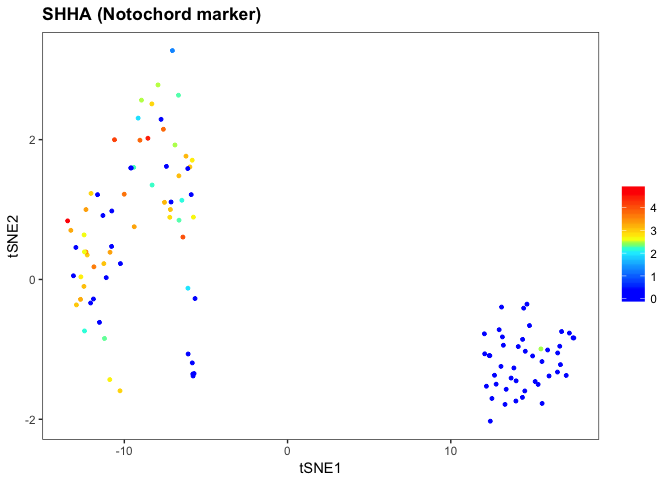

Biased random walks
===================

In order to find the developmental trajectories in the data, we then perform biased random walks that start from each tip. Each walk starts from a random cell in a given tip, and then hops between cells based on the transition probabilities; however, the transition probabilities are first biased so that transitions are only permitted to cells with younger or similar pseudotimes, ensuring that the trajectory between the root and the cell type is found (and that walks do not turn down branches toward other tips).

``` r
# Copy cluster identities from axial.6somite object to a new clustering ("tip.clusters") in the full axial object.
axial@group.ids[rownames(axial.6somite@group.ids), "tip.clusters"] <- axial.6somite@group.ids$`Louvain-50`

# Determine the parameters of the logistic used to bias the transition probabilities. The procedure
# is relatively robust to this parameter, but the cell numbers may need to be modified for larger
# or smaller data sets.
axial.ptlogistic <- pseudotimeDetermineLogistic(axial, "pseudotime", optimal.cells.forward=20, max.cells.back=40, do.plot = T)
```

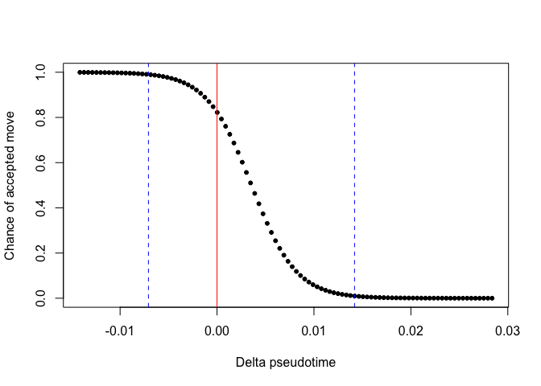

    ## [1] "Mean pseudotime back (~40 cells) 0.0141877922631169"
    ## [1] "Chance of accepted move to equal pseudotime is 0.823515494140705"
    ## [1] "Mean pseudotime forward (~20 cells) -0.00707556824669169"

``` r
# Bias the transition matrix acording to pseudotime
axial.biased.tm <- as.matrix(pseudotimeWeightTransitionMatrix(axial, "pseudotime", logistic.params=axial.ptlogistic))

# Simulate the biased random walks from each tip
axial.walks <- simulateRandomWalksFromTips(axial, tip.group.id="tip.clusters", root.cells=root.cells, transition.matrix = axial.biased.tm, n.per.tip = 25000, root.visits = 1, max.steps = 5000, verbose = F)

# Process the biased random walks into visitation frequencies
axial <- processRandomWalksFromTips(axial, axial.walks, verbose = F)
```

We can then visualize the tips and the visitation of cells from each tip on the dataset.

``` r
plotDim(axial, "tip.clusters", plot.title="Cells in each tip")
```

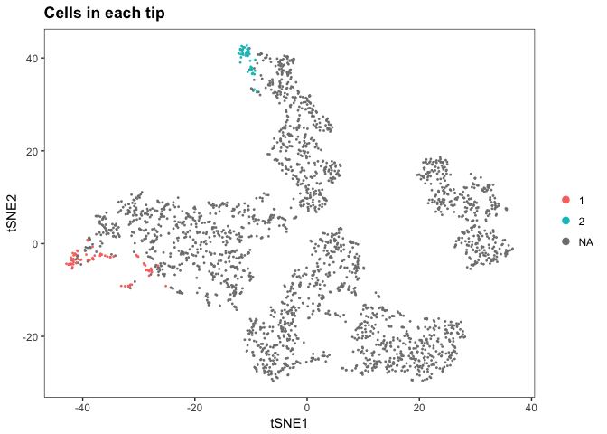

``` r
plotDim(axial, "visitfreq.log.1", plot.title="Visitation frequency from tip 1 (log10)", transitions.plot=10000)
```

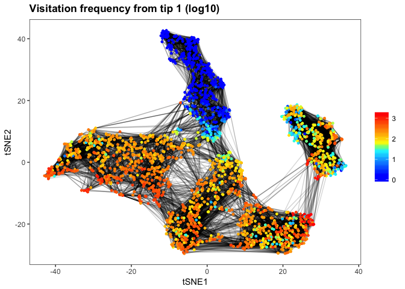

``` r
plotDim(axial, "visitfreq.log.2", plot.title="Visitation frequency from tip 2 (log10)", transitions.plot=10000)
```

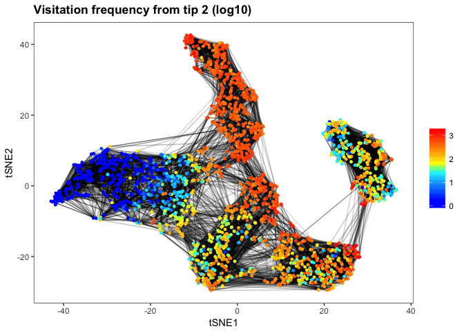

Build tree
==========

We can then build the URD tree structure. This starts from each tip and agglomeratively joins trajectories when they visit the same cells (which indicates an earlier cell type that potentially gives rise to both downstream cell populations). There are several parameters that can be modified in the tree, including the method of determining whether groups of cells are different (`divergence.method`), the p-value threshold used (`p.thresh`), and the number of cells in each window (`cells.per.pseudotime.bin` and `bins.per.pseudotime.window`). In general, adjusting the p-value threshold will make all branchpoints slightly earlier or later. Adjusting the number of cells in each window may be important to make sure that the procedure is buffered from noise (too small windows can cause bizarre fusion results), but if it is too large, cell populations that split near the end of your timecourse may immediately fuse.

**Important note:** Currently, `buildTree` is destructive, so it cannot be run twice on the same object. Thus, we usually save the output of buildTree as a new URD object (here, `axial.tree`).

``` r
# Load the cells used for each tip into the URD object
axial.tree <- loadTipCells(axial, "tip.clusters")

# Build the tree
axial.tree <- buildTree(axial.tree, pseudotime = "pseudotime", tips.use=1:2, divergence.method = "preference", cells.per.pseudotime.bin = 25, bins.per.pseudotime.window = 8, save.all.breakpoint.info = T, p.thresh=0.001)
```

    ## [1] "Calculating divergence between 1 and 2 (Pseudotime 0 to 0.782)"
    ## [1] "Joining segments 1 and 2 at pseudotime 0.44 to create segment 3"
    ## [1] "Assigning cells to segments."

    ## Warning in assignCellsToSegments(object, pseudotime, verbose): 1 cells
    ## were not visited by a branch that exists at their pseudotime and were not
    ## assigned.

    ## [1] "Collapsing short segments."
    ## [1] "Removing singleton segments."
    ## [1] "Reassigning cells to segments."

    ## Warning in assignCellsToSegments(object, pseudotime, verbose): 1 cells
    ## were not visited by a branch that exists at their pseudotime and were not
    ## assigned.

    ## [1] "Assigning cells to nodes."
    ## [1] "Laying out tree."
    ## [1] "Adding cells to tree."

``` r
# Name the segments based on our previous determination of the identity of tips 1 and 2.
axial.tree <- nameSegments(axial.tree, segments=c("1","2"), segment.names = c("Notochord", "Prechordal Plate"), short.names = c("Noto", "PCP"))
```

We can then plot any metadata or gene expression on the dendrogram recovered by URD. (Admittedly, it's not all that impressive when there are only 2 cell types...)

``` r
plotTree(axial.tree, "stage", title="Developmental Stage")
```

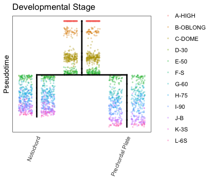

``` r
plotTree(axial.tree, "GSC", title="GSC (early prechordal plate marker)")
```


``` r
plotTree(axial.tree, "NOTO", title="NOTO (early notochord marker)")
```

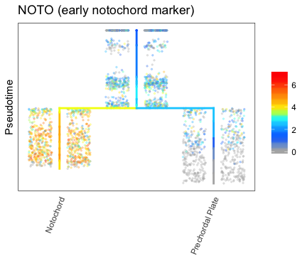

``` r
plotTree(axial.tree, "HE1A", title="HE1A (prechordal plate differentiation marker")
```

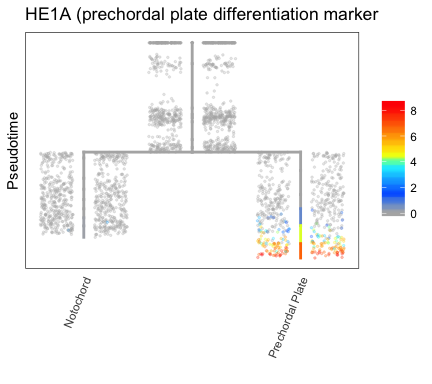

``` r
plotTree(axial.tree, "COL8A1A", title="COL8A1A (notochord differentiation marker")
```

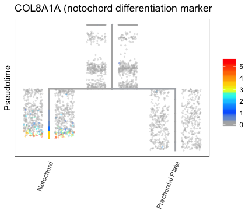

Additionally, we can refer back to the tSNE representation to see where the branchpoint was found.

``` r
plotTree(axial.tree, "segment", title="URD tree segment")
```

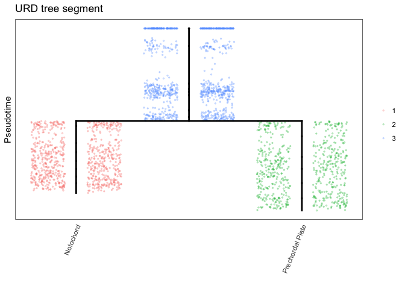

``` r
plotDim(axial.tree, "segment", plot.title="URD tree segment")
```


Force-directed layout
=====================

In addition to the dendrogram-style layout, URD can generate a force-directed layout that is useful for visualizing the data. This generates a k-nearest neighbor network based on cells' visitation by random walks from each tip, then refines that network based on the recovered dendrogram structure, and finally uses that as input into a force-directed layout.

In these layouts, optimizing the number of nearest neighbors (`num.nn`) and the degree of refinement by the dendrogram (`cut.unconnected.segments`) can affect the layout and be used to optimize it.

``` r
# Generate the force-directed layout
axial.tree <- treeForceDirectedLayout(axial.tree, num.nn=100, cut.unconnected.segments=2, verbose=T)
```

    ## [1] "2018-04-30 20:54:14 : Starting with parameters fr 100 NN 2 D 2433 cells"
    ## [1] "Removing 0 cells that are not assigned a pseudotime or a segment in the tree."
    ## [1] "2018-04-30 20:54:14: Preparing walk data."
    ## [1] "2018-04-30 20:54:14: Calculating nearest neighbor graph."
    ## [1] "2018-04-30 20:54:14: Preparing edge list."
    ## [1] "2018-04-30 20:54:15: Removing 0% of edges that are between segments with distance > 2"
    ## [1] "2018-04-30 20:54:15: Trimming cells that are no longer well connected."
    ## [1] "2018-04-30 20:54:15: 100% of starting cells preserved."
    ## [1] "2018-04-30 20:54:15: Preparing igraph object."
    ## [1] "2018-04-30 20:54:16: Doing force-directed layout."
    ## [1] "2018-04-30 20:54:27: Calculating Z."
    ## [1] "2018-04-30 20:54:28: Calculating local density."
    ## [1] "2018-04-30 20:54:28: Finished."

We can then plot various gene expression on the tree. Normally, after running one plot and rotating it to a good orientation, the function `plotTreeForceStore3DView` can be used to set the view for future plots, but that cannot be done in Markdown analysis.

``` r
plotTreeForce(axial.tree, "GSC", title = "GSC", title.cex = 2, title.line=2.5)
```

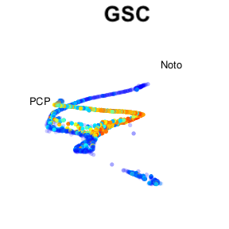

``` r
plotTreeForce(axial.tree, "HE1A", title = "HE1A", title.cex=2, title.line=2.5)
```

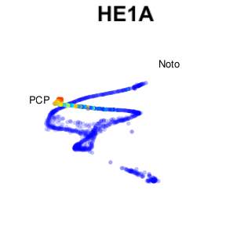

``` r
plotTreeForce(axial.tree, "COL8A1A", title="COL8A1A", title.cex=2, title.line=2.5)
```

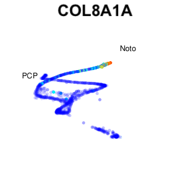

Conclusion
==========

We hope URD will be useful for your own analyses!

If you find our software useful, please cite it: Farrell JA, Wang YW, Riesenfeld SJ, Shekhar K, Regev A, and Schier AF. Single-cell reconstruction of developmental trajectories during zebrafish embryogenesis. *Science* 10.1126/science.aar3131 (2018).

Session Info
============

``` r
sessionInfo()
```

    ## R version 3.4.1 (2017-06-30)
    ## Platform: x86_64-apple-darwin15.6.0 (64-bit)
    ## Running under: macOS Sierra 10.12.6
    ## 
    ## Matrix products: default
    ## BLAS: /Library/Frameworks/R.framework/Versions/3.4/Resources/lib/libRblas.0.dylib
    ## LAPACK: /Library/Frameworks/R.framework/Versions/3.4/Resources/lib/libRlapack.dylib
    ## 
    ## locale:
    ## [1] en_US.UTF-8/en_US.UTF-8/en_US.UTF-8/C/en_US.UTF-8/en_US.UTF-8
    ## 
    ## attached base packages:
    ## [1] stats     graphics  grDevices utils     datasets  methods   base     
    ## 
    ## other attached packages:
    ## [1] URD_1.0.0     Matrix_1.2-12 ggplot2_2.2.1 rgl_0.99.9   
    ## 
    ## loaded via a namespace (and not attached):
    ##   [1] Rtsne_0.13          minqa_1.2.4         colorspace_1.3-2   
    ##   [4] RcppEigen_0.3.3.3.1 class_7.3-14        rprojroot_1.3-2    
    ##   [7] htmlTable_1.11.1    base64enc_0.1-3     rstudioapi_0.7     
    ##  [10] proxy_0.4-20        MatrixModels_0.4-1  ggrepel_0.7.0      
    ##  [13] splines_3.4.1       robustbase_0.92-8   knitr_1.18         
    ##  [16] Formula_1.2-2       jsonlite_1.5        nloptr_1.0.4       
    ##  [19] pbkrtest_0.4-7      cluster_2.0.6       ggforce_0.1.1      
    ##  [22] shiny_1.0.5         compiler_3.4.1      backports_1.1.2    
    ##  [25] assertthat_0.2.0    lazyeval_0.2.1      tweenr_0.1.5       
    ##  [28] acepack_1.4.1       htmltools_0.3.6     quantreg_5.34      
    ##  [31] tools_3.4.1         bindrcpp_0.2        igraph_1.2.1       
    ##  [34] gtable_0.2.0        glue_1.2.0          RANN_2.5.1         
    ##  [37] reshape2_1.4.3      dplyr_0.7.4         gmodels_2.16.2     
    ##  [40] Rcpp_0.12.15        Biobase_2.38.0      gdata_2.18.0       
    ##  [43] nlme_3.1-131        udunits2_0.13       crosstalk_1.0.0    
    ##  [46] ggraph_1.0.1        lmtest_0.9-35       laeken_0.4.6       
    ##  [49] stringr_1.2.0       lme4_1.1-15         mime_0.5           
    ##  [52] gtools_3.5.0        DEoptimR_1.0-8      MASS_7.3-48        
    ##  [55] zoo_1.8-0           scales_0.5.0        VIM_4.7.0          
    ##  [58] parallel_3.4.1      SparseM_1.77        RColorBrewer_1.1-2 
    ##  [61] yaml_2.1.16         curl_3.1            gridExtra_2.3      
    ##  [64] rpart_4.1-11        latticeExtra_0.6-28 stringi_1.1.6      
    ##  [67] e1071_1.6-8         checkmate_1.8.5     destiny_2.6.2      
    ##  [70] TTR_0.23-2          caTools_1.17.1      BiocGenerics_0.24.0
    ##  [73] boot_1.3-20         rlang_0.1.6         pkgconfig_2.0.1    
    ##  [76] bitops_1.0-6        evaluate_0.10.1     lattice_0.20-35    
    ##  [79] ROCR_1.0-7          bindr_0.1           htmlwidgets_0.9    
    ##  [82] labeling_0.3        plyr_1.8.4          magrittr_1.5       
    ##  [85] R6_2.2.2            gplots_3.0.1        Hmisc_4.1-0        
    ##  [88] foreign_0.8-69      mgcv_1.8-22         units_0.5-1        
    ##  [91] xts_0.10-1          survival_2.41-3     sp_1.2-5           
    ##  [94] nnet_7.3-12         tibble_1.3.4        car_2.1-6          
    ##  [97] KernSmooth_2.23-15  rmarkdown_1.8       viridis_0.4.1      
    ## [100] grid_3.4.1          minpack.lm_1.2-1    data.table_1.10.4-3
    ## [103] vcd_1.4-4           digest_0.6.15       diptest_0.75-7     
    ## [106] xtable_1.8-2        httpuv_1.3.5        munsell_0.4.3      
    ## [109] viridisLite_0.2.0   smoother_1.1
